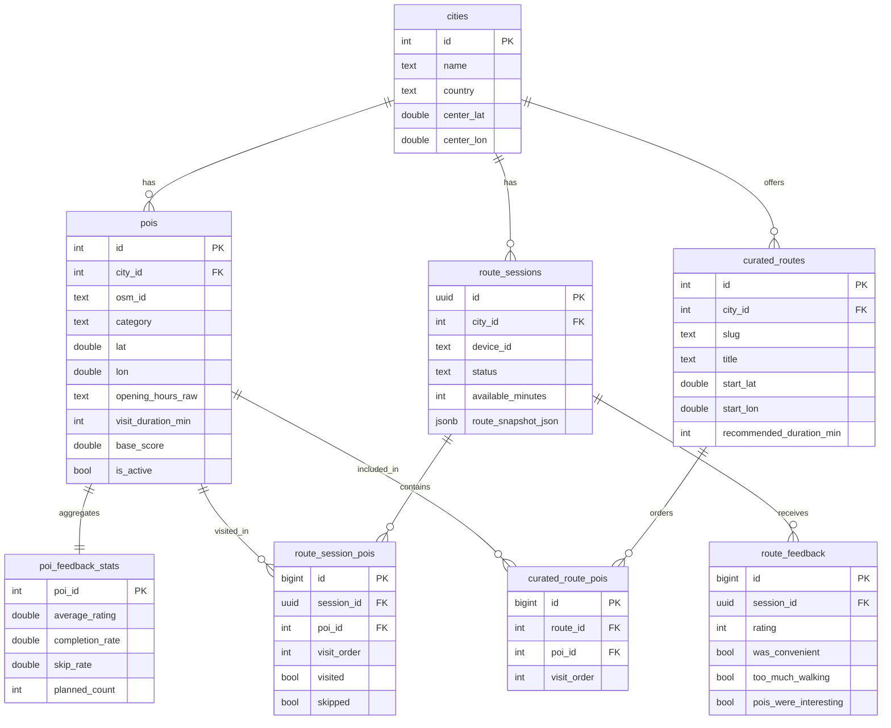
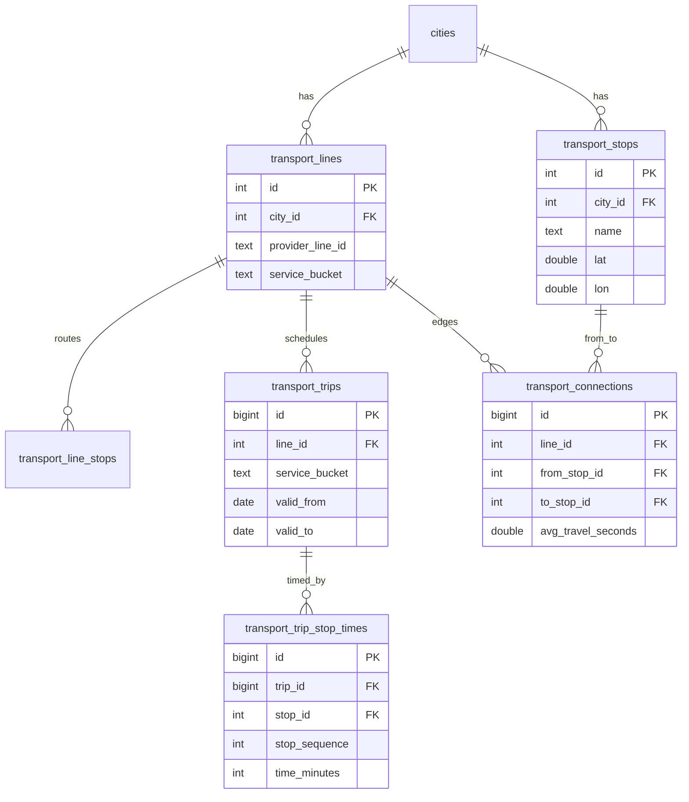
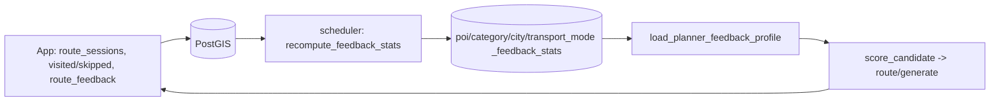

# Architecture

Smart Tourism plans personalized walking (and public-transport) city tours: the
user gives a time budget, interests, start point and pace, and the backend
returns an ordered round trip that respects opening hours and an optional MHD
(public transport) leg. Users rate finished routes, and that feedback feeds back
into the recommendations.

## Components

- `pipeline/` — ETL that builds per-city data: POIs from OpenStreetMap enriched
  with Wikidata/Wikipedia, public-transport graph from imhd.sk, and curated
  tours. Parameterized by city slug from `pipeline/config/cities.yaml`.
- `backend/` — FastAPI service: POI/city metadata, route planning, route
  sessions, feedback, curated routes. Talks to PostGIS and a self-hosted OSRM.
- `android-app/` — Kotlin + Jetpack Compose app: preferences form, online/offline
  map, generated and curated routes, schedule tracking, ratings.
- Infrastructure (`docker-compose.yml`): PostGIS, OSRM (`osrm-routed --algorithm
  mld`), the FastAPI backend, and a `scheduler` container that periodically
  recomputes feedback aggregates.

Five pilot cities are configured: Nitra, Trnava, Nové Zámky, Trenčín, Žilina —
each with its own profile (bbox, categories, routing limits, MHD provider).

## Data flow

1. `pipeline/` imports and prepares city POI, transport and curated-route data
   into PostGIS (schema owned by Alembic migrations).
2. `backend/` serves metadata and generates routes; it queries POI candidates,
   computes travel via OSRM, plans the tour, and persists route sessions and
   feedback.
3. `android-app/` requests cities/POIs/routes, renders them, tracks the schedule,
   and submits ratings.
4. The `scheduler` recomputes feedback aggregates on an interval; the planner
   reads those aggregates when scoring candidates.

## Data model

Schema is managed by Alembic (`backend/migrations/`); `backend/sql/init.sql` is
an intentional placeholder. Core planning and feedback entities:



Feedback aggregates also exist at category, city and transport-mode level
(`category_feedback_stats`, `city_feedback_stats`,
`transport_mode_feedback_stats`), keyed by `city_id` (+ `category` /
`transport_mode`).

Public-transport graph:



## Route planning

`POST /route/generate` (`backend/app/services/route_planning/`):

1. **Candidates** — POIs for the city filtered by interests, ordered by
   `base_score`, joined with feedback aggregates.
2. **Greedy construction** — repeatedly pick the highest-utility next stop that
   fits the time budget and opening hours, advancing the timeline.
3. **Local search** — a 2-opt / or-opt pass reorders the constructed stops to cut
   total travel time without breaking time windows or the budget, and keeps the
   manual order of required POIs.
4. **Timeline** — final legs are materialized with real OSRM geometry; transit
   legs use the public-transport graph (exact schedule when available, otherwise
   an estimated solution).

Performance and resilience:

- **OSRM `/table`** computes the candidate duration matrix in one request instead
  of one `/route` call per pair (the dominant cost); geometry for the chosen legs
  is fetched afterwards. A process-wide cell cache reuses durations across
  requests.
- **Circuit breaker + retry** around OSRM: a per-pair "no route" falls back to a
  straight-line estimate only for that pair, while repeated backend failures open
  a breaker (with cooldown) instead of a permanent latch. Degraded legs are
  reported via `routing_degraded` / `routing_fallback_leg_count`.
- **Opening hours**: a closed-but-soon-to-open stop is waited for up to
  `max_opening_wait_minutes` (per city, default 20) instead of skipped; required
  stops that cannot fit their hours are reported in `closed_required_poi_ids`.
- **City time cap**: `available_minutes` is capped to the city's
  `routing_limits.max_available_minutes`.

## Scoring and feedback loop

Candidate utility (`route_planning/scoring.py`):

```
utility = base_score * 10
        + preferred_bonus                     (required POI)
        + poi_bonus + category_bonus
        + completion_bonus + transport_bonus  (feedback-derived, confidence-weighted)
        - travel_penalty                      (per travel minute)
        - walking_penalty                     (long walks, if users dislike walking here)
        - skip_penalty - repeat_penalty
```

Feedback-derived terms are weighted by a confidence factor proportional to the
sample size, so a POI with little history barely moves from its base score.



The `scheduler` container runs `recompute_feedback_stats()` on an interval
(`FEEDBACK_RECOMPUTE_INTERVAL_SECONDS`, default hourly). Aggregating into stats
tables keeps route generation cheap (a single read) instead of scanning raw
sessions per request.

## API

The backend is the system's API specification: FastAPI serves an auto-generated
**OpenAPI** document at `/openapi.json` and interactive docs at `/docs`.

Main endpoints:

- `GET /health`, `GET /cities`, `GET /pois?city=`
- `GET /cities/{slug}/curated-routes`, `GET /curated-routes/{id}`
- `POST /route/generate`, `POST /route/leg` (rate-limited per client IP)
- `route-sessions` CRUD, POI visit marking, and feedback (device-token
  authenticated via `X-Device-Id` / `X-Device-Token`, stored hashed)

## Operations

- `docker compose up -d --build` starts PostGIS, OSRM, backend and scheduler;
  every service has a healthcheck and the backend runs Alembic on startup.
- Rebuilding routing data: OSRM is prepared with the MLD pipeline
  (`osrm-extract -p /opt/foot.lua` → `osrm-partition` → `osrm-customize`) over the
  region `.osm.pbf` placed in `routing-data/`.
- ETL runbook (POI, transport, curated routes): see
  [../pipeline/README.md](../pipeline/README.md).
- Opening-hours parsing supports a common subset of the OSM `opening_hours`
  grammar (weekday ranges/lists, multiple intervals per day, `24/7`, Slovak
  weekday words); unparseable values fall back to "always open".
